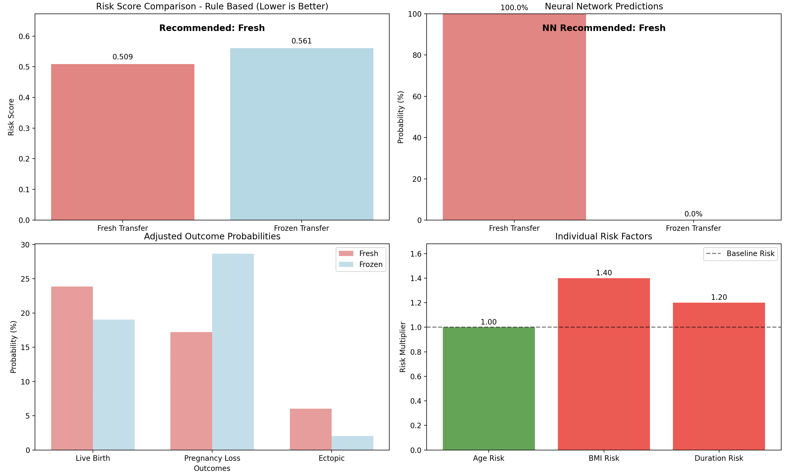

# Embryo Transfer Outcome Predictior (Fresh vs Frozen)

> **Research prototype — Not for clinical use**

This repository implements a PyTorch model to predict IVF outcomes for **Fresh vs Frozen Embryo Transfer (ET)** using **synthetic data** derived from a published RCT (n=838; 419 Fresh, 419 Frozen).  
The model combines a **rule-based risk engine** with a neural network trained on Age, BMI, and Infertility Duration to recommend transfer type.

---

## References
Wei, D., Zhang, Y., Zhao, J., et al. (2025). Fresh versus frozen embryo transfer in women with low prognosis: a multicentre, randomised controlled trial. *The Lancet*, 405(10335), 289–299. https://doi.org/10.1016/S0140-6736(24)02703-2 

---

## Trial Summary

| Outcome | Fresh | Frozen | RR (95% CI) | p-value |
|---------|------:|-------:|-------------|---------|
| Live birth | 40% | 32% | 1.25 (1.06–1.48) | 0.009 |
| Clinical pregnancy | 47% | 39% | 1.19 (1.02–1.38) | 0.02 |
| Ongoing pregnancy | 43% | 36% | 1.19 (1.01–1.40) | 0.04 |
| Pregnancy loss† | 10% | 17% | 0.60 (0.35–1.03) | 0.06 |
| Ectopic† | 4% | 1% | 3.52 (0.75–16.63) | 0.11 |

† % of clinical pregnancies.

---

## Method

1. **Rule-based engine**  
   - Encodes trial outcome rates as priors.  
   - Adjusts for Age, BMI, Duration via multiplicative risk factors.  
   - Outputs composite risk score + recommendation.

2. **Synthetic data generation**  
   - Samples features to match trial baselines.  
   - Labels via rule-based engine (weak supervision).

3. **Neural network**  
   - 3-layer MLP, CrossEntropy loss, Adam optimiser.  
   - Learns to reproduce rule-based recommendations.

4. **Visualisation**  
   - Training curves, outcome probabilities, risk factor multipliers.

---

## Features

- Rule-based risk engine
- Synthetic cohort generator
- Neural network classifier
- Visualisations: training curves, outcome probabilities, risk factor multipliers
- Model persistence (save/load)

---

## Example Output

Below is a sample risk analysis plot generated by `plot_risk_analysis()`:



---

## Limitations

- Labels from heuristics, not patient-level data.  
- Multipliers illustrative, not validated.  
- Probabilities uncalibrated.  
- Educational use only.

---

## Usage

```bash
pip install torch numpy matplotlib
python embryo_transfer.py

